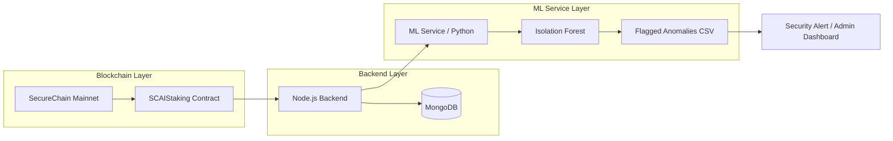

# SCAIStaking ML Service: Blockchain Anomaly Detection

This service provides an unsupervised machine learning layer for the **SCAIStaking** platform. Its primary goal is to detect suspicious on-chain behavior, such as **Sybil attacks** and **micro-staking bots**, which can manipulate staking rewards or congest the network.

## 🎯 Objective
In DeFi, malicious actors often use automated bots to perform thousands of micro-transactions. This can be used to:
1.  **Sybil Attacks**: Creating many fake identities to gain unfair advantage in DAO voting or reward distribution.
2.  **Reward Manipulation**: Exploiting staking protocols that reward transaction frequency.
3.  **Network Congestion**: Artificially inflating transaction volume.

The **SCAIStaking ML Service** identifies these patterns automatically without needing pre-labeled "fraud" data.

## 🧠 Methodology: Isolation Forest
We use the **Isolation Forest** algorithm, which is ideal for blockchain security because:
*   **Unsupervised**: We don't need historical labels of "attacks" to find them.
*   **Efficiency**: It isolates anomalies by randomly selecting features and split values. Anomalies (bots) typically require fewer splits to isolate than normal users.
*   **Features Used**:
    *   `stake_amount`: Bots often use tiny amounts (0.01 - 1.0 SCAI).
    *   `time_since_last_tx_seconds`: Bots interact with the contract every few seconds, whereas normal users interact once every few hours or days.

## 🛠️ ML Workflow
1.  **Data Ingestion**: Simulate/Fetch transaction logs from the SCAIStaking smart contract.
2.  **Feature Engineering**: Calculate time deltas and scale amounts using `StandardScaler`.
3.  **Model Training**: Fit the `Isolation Forest` with a 5% contamination factor (assuming 5% of traffic is malicious).
4.  **Prediction**: Flag transactions with an anomaly score below a specific threshold.
5.  **Alerting**: Export flagged addresses to `flagged_anomalies.csv` for the backend to blacklist or throttle.

## 🏗️ Architecture
The service fits into the full-stack architecture as follows:

## 🚀 Future Integration (FastAPI)
In a production environment, this script would be wrapped in a **FastAPI** wrapper:
*   **Endpoint**: `POST /v1/detect-anomalies`
*   **Input**: Real-time transaction stream from the Node.js backend.
*   **Output**: JSON response flagging high-risk addresses.
*   **Automation**: A Cron job or Webhook that triggers the detection engine every 10 minutes.

## 🔐 Security Context
By connecting **DeFi Staking** with **ML Anomaly Detection**, we move from "Reactive Security" (fixing bugs after an exploit) to "Proactive Security" (identifying and blocking malicious bot patterns before they drain protocol liquidity).

---
**Author**: Antigravity AI Assistant  
**Project**: SCAIStaking Full-Stack Integration (Week 3)
